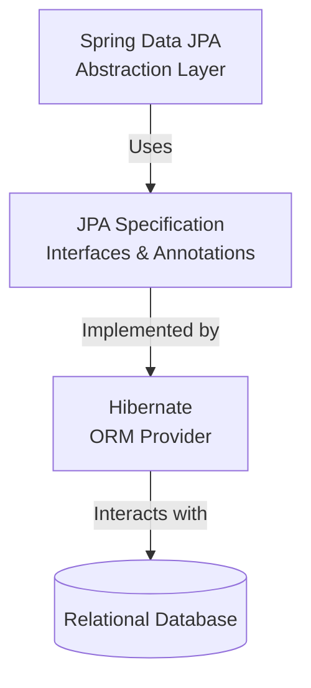

# Difference between JPA, Hibernate, and Spring Data JPA

This document outlines the conceptual differences, relationships, and code comparison between **JPA**, **Hibernate**, and **Spring Data JPA**.

---

## 1. Quick Analogy: The Car Metaphor

To understand how they fit together, imagine building and driving a car:

| Technology | Role | Analogy | Description |
| :--- | :--- | :--- | :--- |
| **JPA** | **Specification** | **The Blueprint / Guidelines** | Defines the rules and interface specifications (e.g., a car must have steering, wheels, and an engine) but cannot be driven by itself. |
| **Hibernate** | **Implementation** | **The Actual Car** | Built based on the blueprint. It contains the actual engine, gears, and code to make the car move (connect to the database and map objects). |
| **Spring Data JPA** | **Abstraction Layer** | **The Autopilot System** | Adds a layer of automation on top of the car. Instead of manually pushing pedals and shifting gears, you just say "Go to Destination" (`save()`, `findById()`). |

---

## 2. Conceptual Overview



### ☕ A. Java Persistence API (JPA)
* **JSR 338 Specification** for persisting, reading, and managing data from Java objects.
* Does not contain concrete implementation of the specification.
* **Hibernate** is one of the implementations of JPA.

### ❄️ B. Hibernate
* **ORM Tool** that implements JPA.

### 🍃 C. Spring Data JPA
* Does not have JPA implementation, but **reduces boilerplate code**.
* This is another level of abstraction over a JPA implementation provider like **Hibernate**.
* **Manages transactions**.

---

## 3. Comparison Table

| Feature | JPA | Hibernate | Spring Data JPA |
| :--- | :--- | :--- | :--- |
| **Type** | Specification (Standard/Guidelines) | ORM Framework (Implementation) | Framework / Abstraction Layer |
| **Developer** | Oracle (now Eclipse Foundation) | Red Hat (JBoss) | Spring Source (VMware) |
| **Does it run code?** | No (only defines APIs) | Yes (executes queries and maps objects) | Yes (generates boilerplate code at runtime) |
| **Key APIs/Classes** | `javax.persistence.EntityManager` | `org.hibernate.Session` | `org.springframework.data.repository.Repository` |
| **Boilerplate Code** | High (if using raw JPA) | Medium to High (manual transactions) | Exceptionally Low (interface-driven) |
| **Transaction Management** | Requires manual or JTA container control | Handled via Hibernate `Transaction` API | Handled declaratively with `@Transactional` |

---

## 4. Code Comparison: Saving an Employee

Below is a comparison of how you would write code to save an `Employee` object using Hibernate vs. using Spring Data JPA.

### ❌ Option 1: Using Hibernate (Manual Management)
```java
/* Method to CREATE an employee in the database */
public Integer addEmployee(Employee employee){
   Session session = factory.openSession();
   Transaction tx = null;
   Integer employeeID = null;
   
   try {
      tx = session.beginTransaction();
      employeeID = (Integer) session.save(employee); 
      tx.commit();
   } catch (HibernateException e) {
      if (tx != null) tx.rollback();
      e.printStackTrace(); 
   } finally {
      session.close(); 
   }
   return employeeID;
}
```

###  Option 2: Using Spring Data JPA
With Spring Data JPA, the codebase is simplified into a Repository interface and a Service class:

#### `EmployeeRepository.java`
```java
public interface EmployeeRepository extends JpaRepository<Employee, Integer> {

}
```

#### `EmployeeService.java`
```java
@Autowired
private EmployeeRepository employeeRepository;

@Transactional
public void addEmployee(Employee employee) {
    employeeRepository.save(employee);
}
```
*(Note: `@Autowired` is used here instead of the typo `@Autowire` to ensure correct compiling in Spring applications.)*

---

## 5. Differences with Spring

To understand how Spring's modules evolve and interoperate, it is important to distinguish between **Spring Core vs. Spring Boot**, and **Spring Data JPA vs. Spring JDBC**.

### 5.1 Spring Framework (Traditional/Core) vs. Spring Boot
While Spring Framework provides the core Dependency Injection (IoC) engine, Spring Boot simplifies its bootstrapping and configuration.

| Feature | Spring Framework (Traditional/Core) | Spring Boot |
| :--- | :--- | :--- |
| **Primary Goal** | Core dependency injection and application framework. | Rapid application setup and configuration (bootstrapping). |
| **Configuration** | Manual (via XML files or Java `@Configuration` classes). | **Auto-configuration** (based on classpath dependencies). |
| **Boilerplate Code** | High (manual definition of DataSources, EntityManagers, etc.). | Minimal (creates standard beans automatically). |
| **Dependency Mgmt** | Manual version selection for each dependency in `pom.xml`. | **Starter POMs** that group dependencies and manage versions. |
| **Server Deployment** | Packaged as a `.war` and deployed to an external Tomcat server. | Packaged as a `.jar` with an **embedded Tomcat server** (run-and-go). |

### 5.2 Spring Data JPA vs. Spring JDBC (JdbcTemplate)
Spring offers different levels of database abstraction:

| Feature | Spring JDBC (`JdbcTemplate`) | Spring Data JPA |
| :--- | :--- | :--- |
| **Abstraction Level** | Low (wraps raw JDBC connections and cleanup). | High (ORM repository abstraction on top of Hibernate). |
| **SQL Writing** | **Required**. You must write raw SQL queries yourself. | **Optional**. Queries are automatically generated from method names. |
| **Mapping** | Manual mapping of database rows via a `RowMapper`. | Automatic mapping of database tables to Entity classes. |
| **Boilerplate Code** | Medium. Saves database management but requires SQL. | Exceptionally low. Interface-only implementations. |

---

## 6. Summary
* **JPA** is the **What** (Rules/Guidelines).
* **Hibernate** is the **How** (The Engine/Implementation).
* **Spring Data JPA** is the **Convenience** (The Autopilot/Boilerplate reducer).
* **Spring Framework (Core)** is the **Foundation** (IoC / Dependency Injection engine).
* **Spring Boot** is the **Accelerator** (Embedded server, Auto-configuration, and Starter dependencies).

